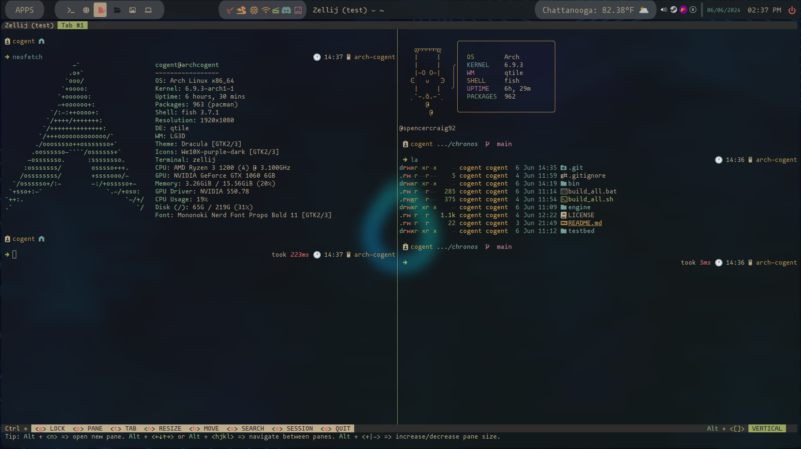
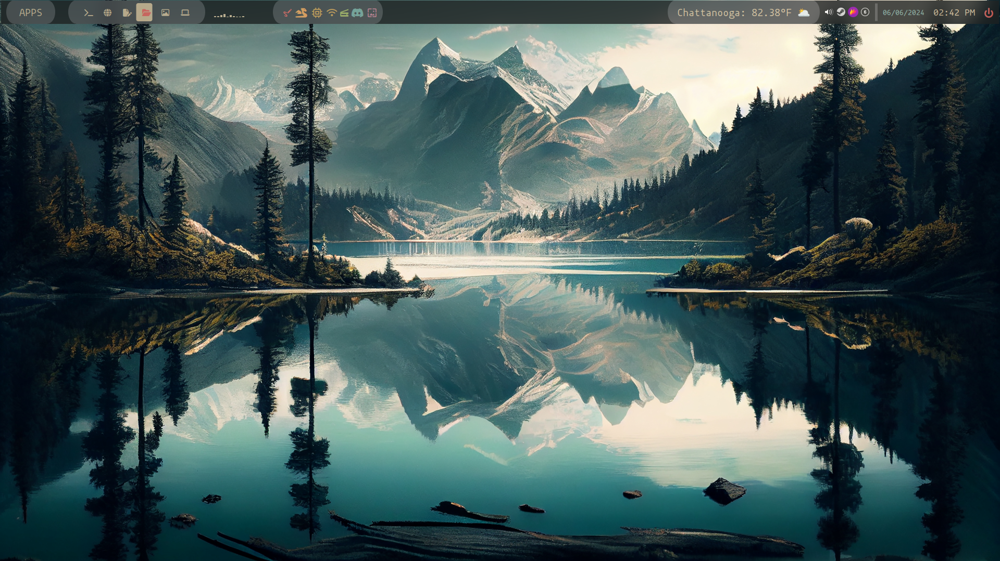
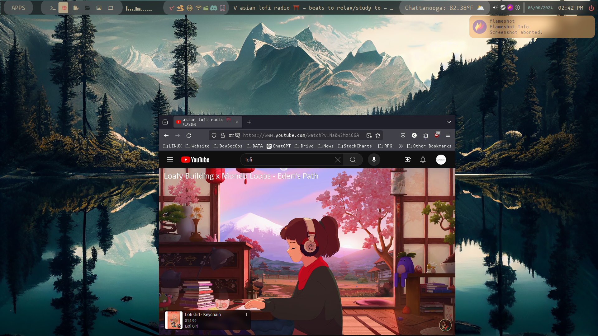
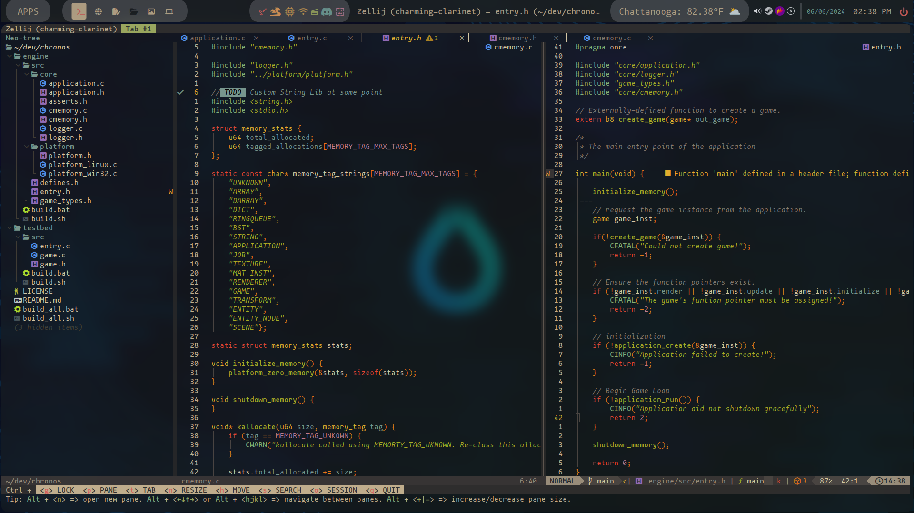

# An Arch Linux Qtile Configuration w/ installer
# (USE X11 not WAYLAND)




### The installer is stable, but it requires MONONOKI NERD FONT so pick that option as the initial Nerd Font in the installer 
+ It is still a WIP so *ONLY* install if you know what you are doing in Arch and Qtile
+ Always browse the source in the scripts before installing blindly!! 😄

### Installation (X11 Not Wayland)
+ Clean minimal install of Arch based on your pc specs
    + required packages in the arch install
        + multilib repo if using Nvidia GPU
        + Pipewire for audio
        + git
        + text editor of your choice (in case something goes horribly wrong)
        + pacman (should be installed with arch but I like to double check)
+ Login to your fresh new minimal Install
    + Make sure you are connected to the interwebs
        + NetworkManager is enabled (if thats what you went with)
        + refer to the [arch wiki](https://wiki.archlinux.org/title/Network_configuration) if stuck
    + Clone the repo to your home directory
        + ```git clone https://github.com/wsc92/dotfiles```
    + cd into the cloned directory
        + ```cd dotfiles```
    + Run the install.sh script
        + ```./install.sh```
+ Read the Prompts and make sure to pick Mononoki Nerd Font as the nerd-font to install
    + The script will prompt you to reboot when complete select "y" (you must reboot)
+ After the reboot it will launch into sddm with the sugar-dark theme and when you first login make sure to pick Qtile not Qtile(Wayland)
+ after the window manager is running and you have logged in and its not a blank screen otherwise an error occured
+ run arch-linux-tweaktool to get your GTK themes, file icons, and cursors
    + key command is: super + r then navigate to the tool
    + then use the tool to get the keys and repos in pacman
    + install the themes you want
    + install the icons you want
    + install the cursors you want
#### Remember to set the themes with GTK settings in the menu or in a terminal
+ the terminal command is 
    + ```nwg-look```
### After arch-linux-tweak tool updates pacman and you install your themes.... on the next reboot it will generate a new sddm config file

##### To fix this
+ open a terminal super + enter
+ navigate to the sddm config folder
    + ```cd /etc/sddm.conf.d```
    + ```ls```
    + there should be two files default and one that starts with KDE 
    + remove the one that starts with KDE with ```rm <nameofcreatedfile>```

### Packages
+ it does have quite a few packages so it can take a while to install with various user input prompts so read as you run the ./install.sh script
+ Package Managers
    + pacman
    + yay
    + snap
+ Shells
    + Fish
    + Bash
+ Terminals
    + alacritty (zellij as terminal multiplexer)
    + Kitty (simple bash)
    + starship for prompts
+ Editor
    + Neovim
    + Vim
    + Gedit (simple GUI)
+ Programs
    + Morgen (calendar)
    + Nemo (file manager)
    + draw.io (for design mapping)
    + Obsidian (Notetaker)
    + Ghidra (disassembler)
    + Zenmap (port scanner)
    + wireshark  (Network monitor)
    + BurpSuite
    + discord
    + GIMP
    + Blender
    + Arch-linux-tweak tool for easier GTK theming
    + Nitrogen (GUI wallpaper)
    + feh (cli wallpaper)
    + cava
    + npm
    + gem
    + Node
    + and im sure im forgetting some

## Key Commands 
+ working on the full list will have it built into system soon
    + in the meantime look for keys.py in the .config/qtile folder
### super key by default is the windows key
+ super + q = quit
+ super + w = change wallpaper (add more to wallpapers in home)
+ super + e = File Manager (Nemo)
+ super + r = rofi drun
+ super + ENTER = launch Alacritty (fish shell)
+ super + k = Launch Kitty (bash shell)
+ super + i = Toggle Floating window
+ super + b = Launch Firefox
+ super + c = Launch Firefox (chatGPT)
+ super + n = Launch Obsidian
+ super + g = Screen Grab tool (Flameshot)
+ super + TAB = all apps that are open menu and workstation number
+ super + [1-6] = change workspace
+ super + shift + [1-6] = move application to that workspace

